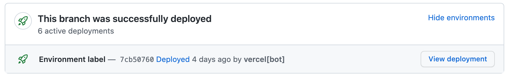

# Wait for deployments

Waits for all GitHub deployments to succeed before continuing.

You can use this to wait for your deployments to finish building before running tests against the live versions of your websites.

## Usage

See [action.yml](https://github.com/useparcel/wait-for-deployments-action/)

```yml
on: [pull_request]
jobs:
  wait_for_deployments_job:
    runs-on: ubuntu-latest
    name: Log deployments
    steps:
      - name: Wait for deployments
        id: wait
        uses: useparcel/wait-for-deployments-action@1.0.0
        with:
          github_token: ${{ secrets.GITHUB_TOKEN }}
```

## Inputs

- `github_token` - GitHub access token. Required.
- `environment_filter` - Regular expression to filter whic henvironments we are waiting for.
- `initial_delay` - Time to wait before starting checks. Defaults to `0s`.
- `check_interval` - Time to wait between deployment checks. Defaults to `30s`.
- `max_timeout` - Time to wait for the deploys to finish. Defaults to `20m`.

`initial_delay`, `check_interval`, and `max_timeout` all accept a "[to-time](https://www.npmjs.com/package/to-time)" input.

The following are all valid inputs: `1 hour`, `1h`, `1 minute`, `1m`, `30 seconds`, `30s`, `10 minutes 15 seconds`, `10m 15s`, `5000 milliseconds`, `5000ms`.

## Output

After this action completes, you will have access to the variable `deployments` which contains an stringified JSON array of deployments containing the following properties.

- `environment` - Deployment environment name. This is the label on the left hand side of the deployments table.
- `url` - Target url for the deployment. This is the button on the right hand side of the deployments table.



```yml
on: [pull_request]
jobs:
  wait_for_deployments_job:
    runs-on: ubuntu-latest
    name: Log deployments
    steps:
      - name: Wait for deployments
        id: wait
        uses: useparcel/wait-for-deployments-action@1.0.0
        with:
          github_token: ${{ secrets.GITHUB_TOKEN }}
+     - name: Log deployments
+       id: log
+       run: echo "${{ steps.wait.outputs.deployments }}"
```

## Error handling

If a deployment fails, this action will fail as well.

You can catch this error with an additional step:

```yml
on: [pull_request]
jobs:
  wait_for_deployments_job:
    runs-on: ubuntu-latest
    name: Log deployments
    steps:
      - name: Wait for deployments
        id: wait
        uses: useparcel/wait-for-deployments-action@1.0.0
        with:
          github_token: ${{ secrets.GITHUB_TOKEN }}
      - name: Log deployments
        id: log
        run: echo "${{ steps.wait.outputs.deployments }}"
+     - name: Deployment failed
+       if: ${{ failure() }}
+       id: failed
+       run: echo "Something went wrong"
```
